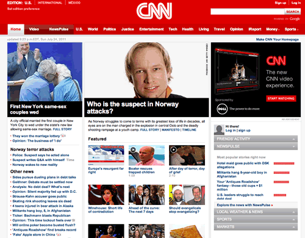
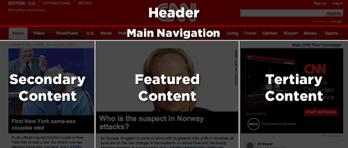
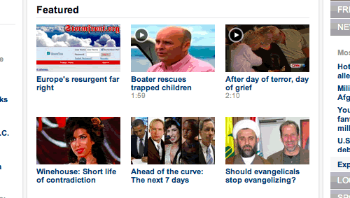

<h3><em>An evolving guide to CSS architecture for sites small and large.</em></h3>

I've long lost count of how many web sites I've built. You'd think after having built a few hundred of them I'd have discovered the "one true way" of doing it. I don't think there is one true way. What I <em>have</em> discovered are techniques that can keep CSS more organized and more structured, leading to code that is easier to build and easier to maintain.

I've been analyzing my process (and the process of those around me) and figuring out how best to structure my code for projects on a larger scale. The concepts were vaguely there with the smaller sites that I had worked on but have become more concrete as a result of working on more complex projects. Small sites don't often hit the same pain points as a larger site; small sites aren't as complex and don't change as often. However, what I intend to describe in these pages is an approach that can work equally well for sites small and large.

SMACSS (pronounced "smacks") is more style guide than rigid framework. There's no library within here for you to download or install. SMACSS is a way to examine your design process and as a way to fit those rigid frameworks into a flexible thought process. It's an attempt to document a consistent approach to site development when using CSS. And really, who isn't building a site with CSS these days?! Feel free to take this in its entirety or use only the parts that work best for you. Or don't use it at all. I understand that this won't be everybody's cup of tea. When it comes to web development, the answer to most questions is "it depends".

<h2>Who am I?</h2>

I'm <a href="http://snook.ca/">Jonathan Snook</a>. I blog at Snook.ca where I share tips, tricks, and bookmarks on web development. I currently work for Yahoo! as Lead Prototyper. Follow me on <a href="http://twitter.com/snookca">Twitter</a>.

<h2>What's in here?</h2>

My thoughts have been compartmentalized around a number of topics related to CSS architecture. Each thought is detailed in its own section. Read the sections in sequence or out of order or pick and choose what seems most relevant to you. It's not 1000 pages of writing; the sections are relatively short and easy to digest.

I also intend for this to be a discussion. I would like to continue to expand on what I have here with more content, more examples, and more articles that expand on the base concept. Provide your feedback and let's discuss a better way to approach CSS architecture.

Dive in!

<h1>The Four Types of CSS Rules</h1>

Every project needs some organization. Throwing every new style you create onto the end of a single file would make finding things more difficult and would be very confusing for anybody else working on the project. Of course, you likely have some organization in place already. Hopefully, what you read among these pages will highlight what works with your existing process and, if I'm lucky, you'll see new ways in which you can improve your process.

How do you decide whether to use ID selectors, or class selectors, or any number of selectors to decide which elements should get the styling magic you wish to bestow upon it? How do you make it easy to understand how your site and your styles are organized? 

At the very core of SMACSS is categorization. By categorizing CSS rules, we begin to see patterns and can define better practices around each of these patterns.

The four types of categories are:

<ol>
<li>Base</li>
<li>Layout</li>
<li>Module</li>
<li>State</li>
</ol>

We often find ourselves mixing styles across each of these categories. But if we're more aware of what we're trying to style, we can avoid the complexity that comes from intertwining these rules.

Each category has certain guidelines that apply to it. This somewhat succinct separation allows us to ask ourselves questions during the development process. How are we going to code things and <em>why</em> are we going to code them that way?

Much of the purpose of categorizing things is to codify patterns—things that repeat themselves within our design. Repetition results in less code, easier maintenance, and greater consistency in the user experience. These are all wins. Exceptions to the rule can be advantageous but they should be justified.

<strong>Base styles</strong> are the defaults that we set. They're almost exclusively single element selectors but it could include attribute selectors, pseudo-class selectors, child selectors or sibling selectors. Essentially, a base style says that whereever this element is on the page, it should look like <em>this</em>.

Examples of Base Styles

<pre><code>html, body, form { margin: 0; padding: 0; }
input[type=text] { border: 1px solid #999; }
a { color: #039; }
a:hover { color: #03C; }</code></pre>

<strong>Modules</strong> are the reusable, modular parts of our design. They are the callouts, the sidebar sections, and the product list and so on.

<strong>Layout styles</strong> divide the page into sections. Layouts hold all your modules together.

Finally, <strong>State styles</strong> are ways to describe how our modules or layouts will look when in a particular state. Is it hidden or expanded? Is it active or inactive?
 

<h2>Naming Convention</h2>

By separating as we have, we have the benefit of using naming convention as a way of understanding immediately which category a particular style belongs to and its role within the overall scope of the page. On large projects, you are more likely to have styles broken up across multiple files. In these cases, naming convention also makes it easier to find which file a style belongs to.

Is it <code>.red-background</code> or <code>.error-msg</code>?

I use a prefix to differentiate the different between the different types of rules. Feel free to pick an approach that works best for you. I use <code>l-</code> for Layout, and <code>s-</code> for State. 

Examples of Layout and State rules

<pre><code>.l-grid { 
float: left; 
}
.s-error { 
color: #F00; 
       background-color: #FEE; 
}
.s-hidden { 
position: absolute;
left: -999em;
}</code></pre>

Modules are going to be the bulk of any project. As a result, having every module start with a prefix like <code>.mod-</code> would be needlessly verbose. If it doesn't start with <code>l-</code> or <code>s-</code> then it must be a module. For modules, I try to stick to a three letter prefix.

Examples of Module classes

<pre><code>/* Example Module */
.exm { }

/* Callout Module */
.cll { }

/* Form field module */
.fld { }
</code></pre>

These three letter rules would then be used for any related styles. On this site, for example, code examples use the <code>.exm</code> class and the captions use a <code>.exm-caption</code> class. I can instantly look at the caption class and understand that it's related to the code examples and where I can find the styles for that.
 

This naming convention will be used throughout these pages. Like most other things that I've outlined here, don't feel that you have to stick to these guidelines rigidly. Have a convention, document it, and stick to it.

<h1>Base Rules</h1>

A Base style is applied to an element using an element selector, a descendent selector, or a child selector, along with any pseudo-classes. It doesn't include any class or ID selectors. It's defining the default styling for how that element should look in all occurrences on the page.

Example Base Styles

<pre><code>body, form {
margin: 0;
padding: 0;
}

a {
color: #039;
}

a:hover {
color: #03F;    
  }
</code></pre>

Base styles include setting heading sizes, default link styles, default font styles, and body backgrounds. There should be no need to use <code>!important</code> in a Base style.

It's also highly recommended that you specify a body background as some users may define their own background as something other than white. If you work off the expectation that the background will be white, your design may look broken. Worse, your font colour choice may clash with the user's setting and make your site unusable.

<h2>CSS Resets</h2>

A CSS Reset is a set of Base styles designed to strip out—or <em>reset</em>—the default margin, padding, and other properties. It's purpose is to define a consistent foundation across browsers to build the site on.

Many reset frameworks can be overly aggressive and can introduce more problems than they solve. Removing margin and padding from elements only to introduce them again creates duplicated effort and increases the amount of code needed to be sent to the client.

Many find resetting styles a helpful tool in site development. Just be sure to understand the drawbacks, if any, of the framework you wish to use and plan accordingly.

<h1>Layout Rules</h1>

CSS, by its very nature, is used to lay elements out on the page. However, there is a distinction between layouts dictating the major and minor components of a page. The minor components—such as a callout, or login form, or a navigation item—sit within the scope of major components such as a header or footer. I refer to the minor components as Modules and will dive into those in the next section. The major components are referred to as Layout styles. 

Layout styles can also be divided into major and minor styles based on reuse. Major styles such as header and footer are likely to be styled using ID selectors, although class selectors could work equally well. It's not necessary to use element selectors with a Layout style.

Layout declarations

<pre><code>#header, #article, #footer {
width: 960px;
margin: auto;
}

#article {
border: solid #CCC;
        border-width: 1px 0 0;
}
</code></pre>

Some sites may have a need for a more generalized layout framework (for example, <a href="http://960.gs/">960.gs</a>). These minor Layout styles will use class names instead of IDs so that the styles can be used multiple times on the page.

Generally, a Layout style only has a single selector: a single ID or class name. However, there are times when a Layout needs to respond to different factors. For example, you may have different layouts based on user preference. This layout preference would still be declared as a Layout style and used in combination with other Layout styles. 

Use of a higher level Layout style affecting other Layout styles.

<pre><code>#article {
float: left;
}

#sidebar {
float: right;
}

.l-flipped #article {
float: right;
}

.l-flipped #sidebar {
float: left;
}
</code></pre>

In the Layout example, the .l-flipped class is applied on a higher level element such as the body element and allows the article and sidebar content to be swapped, moving the sidebar from the right to the left and vice versa for the article.

Using two Layout styles together to switch from fluid to fixed layout.

<pre><code>#article {
width: 80%;
float: left;
}

#sidebar {
width: 20%;
float: right;
}

.l-fixed #article {
width: 600px;
}

.l-fixed #sidebar {
width: 200px;
}
</code></pre>

In this last example, the <code>.l-fixed</code> class modifies the design to change the layout from fluid (using percentages) to fixed (using pixels).

One other thing to note in the Layout example is the naming convention that I've used. The declarations that use ID selectors are named accurately and with no particular namespacing. The class-based selectors, however, <em>do</em> use an <code>l-</code> prefix. This helps easily identify the purpose of these styles and separate them from Modules or States. Layout styles are the only primary category type to use ID selectors, if you choose to use them at all. If you wish to namespace your ID selectors, you can, but it's not as necessary to do so.

<h4>Using ID selectors</h4>

To be clear, using ID attributes in your HTML can be a good thing and in some cases, absolutely necessary. For example, they provide efficient hooks for JavaScript. For CSS, however, ID selectors aren't necessary as the performance difference between ID and class selectors is nearly non-existent and can make styling more complicated due to increasing specificity.

<h4>Layout Examples</h4>

Theory is one thing but application is another. Let's take a look at an actual web site and consider what is part of the layout and what is a module.

In taking a look at the CNN web site, there are a number of patterns that occur in plenty of web sites. For example, there's a header, a navigation bar, a content area and a footer (not seen in the screenshot).

At the time of this writing, the web site follows very closely to this break down and provides ID attributes for these major sections.

Our CSS structure might look something like this:

<pre><code>#header { &hellip; }
#primarynav { &hellip; }
#maincontent { &hellip; }

&lt;div id=&quot;header&quot;&gt;&lt;/div&gt;
&lt;div id=&quot;primarynav&quot;&gt;&lt;/div&gt;
&lt;div id=&quot;maincontent&quot;&gt;&lt;/div&gt;

</code></pre>

Okay, that was straightforward and I'm sure you're thinking, "Really? You're showing me how to do a this?!" Let's take a look at another part of the page.

 

Taking a look at the Featured section, we see a grid of news items. CNN's current markup is a container <code>div</code> with a series of child <code>div</code>s. I would have likely gone with an unordered list, so let's do that instead.

Example HTML code for the Featured section layout

<pre><code>&lt;div&gt;
&lt;h2&gt;Featured&lt;/h2&gt;
&lt;ul&gt;
&lt;li&gt;&lt;a href=&quot;&hellip;&quot;&gt;&hellip;&lt;/a&gt;&lt;/li&gt;
&lt;li&gt;&lt;a href=&quot;&hellip;&quot;&gt;&hellip;&lt;/a&gt;&lt;/li&gt;
&hellip;
&lt;/ul&gt;
&lt;/div&gt;
</code></pre>

Without considering the SMACSS approach to this, we might be inclined to add a ID of "featured" to the surrounding DIV and then style up the contents from there.

A possible approach to styling the list of featured items

<pre><code>div#featured ul { 
margin: 0;
padding: 0;
         list-style-type: none;
}

div#featured li {
float: left;
height: 100px;
        margin-left: 10px;
}
</code></pre>

There are some assumptions that we make with this approach:

<ol>
<li>There will only ever be one featured section on the page</li>
<li>List items are floated to the left</li>
<li>List items have a height of 100 pixels</li>
</ol>

These may be reasonable assumptions to make. This is a prime example of where a small site can get away with this structure: it's unlikely to change and it's unlikely to become more complex than it already is. <em>Maybe.</em> Larger sites with a higher rate of change just have a higher chance of refactoring a component within the page and needing to readdress the styling that goes with it.

Looking back at the code example, there are definitely some optimizations that could be made. The ID selector didn't need to be qualified with a tag selector, too, and since the list is a direct descendant of the <code>div</code>, the child selector (&gt;) could've been used.

Let's take a look at how this could be readdressed to give us some more flexibility.

From a layout perspective, all we care about is how each item relates to each other. We don't care, necessarily, about the design of the modules themselves nor do we want to have to worry about the context that this layout sits within.

Grid Module applied to OL or UL.

<pre><code>.l-grid {
margin: 0;
padding: 0;
         list-style-type: none;
}

.l-grid &gt; li {
display: inline-block;
margin: 0 0 10px 10px; 

        /* IE7 hack to mimic inline-block */
        *display: inline;
        *zoom: 1;
}
</code></pre>

What problems were solved with this approach and what problems did we introduce? (Very rarely does <em>any</em> solution solve 100% of the problem.)

<ol>
<li>The grid layout can now be applied to any container to create a float-style layout</li>
<li>We've decreased the <em>depth of applicability</em> by 1</li>
<li>We've reduced the specificity of the selectors</li>
<li>The height requirement has been removed. A particular row will grow to the height of the tallest item in that row.</li>
</ol>

On the flip-side, how did we make things worse?

<ol>
<li>By using a child selector, we're locking out IE6. (We could get around this by avoiding the child selector.)</li>
<li>The CSS has increased in size and in complexity.</li>
</ol>

The increase in size can't be disputed but it's also nominal. Now that we have this reusable module, we can apply it throughout the site without code duplication. The increase in complexity is also nominal. We did have to work around outdated browsers and thrown in hacks that may be frowned upon by some. However, the selectors are less complex.

<h1>Module</h1>

As briefly mentioned in the previous section, a Module is a more discrete component of the page. It's your navigation bars and your carousels and your dialogs and your widgets and so on. This is the meat of the page. Modules sit inside Layout components. Modules can sometimes sit within other Modules, too. Each Module should be designed to exist as a standalone component. In doing so, the page will be more flexible. If done right, Modules can easily be moved to different parts of the layout without breaking.

When defining the rule set for a module, avoid using IDs and element selectors, sticking only to class names. A module will likely contain a number of elements and there is likely to be a desire to use descendent or child selectors to target those elements. 

Module example

<pre><code>.module > h2 {
padding: 5px;
}

.module span {
padding: 5px;
}</code></pre>

<h2>Avoid element selectors</h2>

Use child or descendant selectors with element selectors if the element selectors will and can be predictable. Using <code>.module span</code> is great if a span will predictably be used and styled the same way every time while within that module.

Styling with generic element

<pre><code>&lt;div class=&quot;fld&quot;&gt;
&lt;span&gt;Folder Name&lt;/span&gt;
&lt;/div&gt;

/* The Folder Module */
.fld > span {
  padding-left: 20px;
background: url(icon.png);
}
</code></pre>

The problem is that as a project grows in complexity, the more likely that you'll need to expand a component's functionality and the more limited you'll be in having used such a generic element within your rule.

Styling with generic element

<pre><code>&lt;div class=&quot;fld&quot;&gt;
&lt;span&gt;Folder Name&lt;/span&gt; 
&lt;span&gt;(32 items)&lt;/span&gt;
&lt;/div&gt;
</code></pre>

Now we're in a pickle. We don't want the icon to appear on both elements within our folder module. Which leads me to my next point:

<em>Only include a selector that includes semantics.</em> A span or div holds none. A heading has some. A class defined on an element has plenty.

Styling with generic element

<pre><code>&lt;div class=&quot;fld&quot;&gt;
&lt;span class="fld-name"&gt;Folder Name&lt;/span&gt; 
&lt;span class="fld-items"&gt;(32 items)&lt;/span&gt;
&lt;/div&gt;
</code></pre>

By adding the classes to the elements, we've increased the semantics of what those elements mean and removed any ambiguity when it comes to styling them.

If you do wish to use an element selector, it should be within one level of a class selector. In other words, you should be in a situation to use child selectors. Alternatively, you should be extremely confident that the element in question will not be confused with another element. The more semantically generic the HTML element (like a span or div), the more likely it will create a conflict down the road. Elements with greater semantics like headings are more likely to appear by themselves within a container and you're more likely able to use an element selector successfully.

<h2>New Contexts</h2>

Using the module approach also allows us to better understand where context changes are likely to occur. The need for a new positioning context, for example, is likely to happen at either the layout level or at the root of a module.

<h2>Subclassing Modules</h2>

When we have the same module in different sections, the first instinct is to use a parent element to style that module differently.

Subclassing

<pre><code>.pod { 
width: 100%; 
}
.pod input[type=text] { 
width: 50%; 
}
#sidebar .pod input[type=text] { 
width: 100%; 
}
</code></pre>

The problem with this approach is that you can run into specificity issues that require adding even more selectors to battle against it or to quickly fall back to using <code>!important</code>.

Expanding on our example pod, we have an input with two different widths. Throughout the site, the input has a label beside it and therefore the field should only be half the width. In the sidebar, however, the field would be too small so we increase it to 100% and have the label on top. All looks well and good. Now, we need to add a new component to our page. It uses most of the same styling as a <code>.pod</code> and so we re-use that class. However, this pod is special and has a constrained width no matter where it is on the site. It's a little different, though, and needs a width of 180px.

Battling against specificity

<pre><code>.pod { 
width: 100%; 
} 
.pod input[type=text] { 
width: 50%; 
}
#sidebar .pod input[type=text] { 
width: 100%; 
}

.pod-callout { 
width: 200px; 
}
#sidebar .pod-callout input[type=text],
.pod-callout input[type=text] { 
width: 180px; 
}
</code></pre>

We're doubling up on our selectors to be able to override the specificity of <code>#sidebar</code>.

What we should do instead is recognize that the constrained layout in the sidebar is a subclass of the pod and style it accordingly.

Battling against specificity

<pre><code>.pod { 
width: 100%; 
} 
.pod input[type=text] { 
width: 50%; 
}
.pod-constrained input[type=text] { 
width: 100%; 
}

.pod-callout { 
width: 200px; 
}
.pod-callout input[type=text] { 
width: 180px; 
}
</code></pre>

Try to avoid conditional styling based on location. If you are changing the look of a module for usage elsewhere on the page or site, sub-class the module instead. 

To help battle against specificity (and if IE6 isn't a concern), then you can double up on your class names like in the next example.

Subclassing

<pre><code>.pod.pod-callout { }
</code></pre>

You may concerned about this depending on the order of loading. For example, on Yahoo! Mail, we have code coming from different places. We had our base button styles and then we had a special set of buttons for the compose screen. However, when you clicked to add a contact to your address book, it loaded a component from a different product: Address Book. (Yes, the address book is a different product within Yahoo!.) The address book loaded its own base button styles, thereby overwriting the subclassed button styles that we had.

If load order is a factor in your project, watch out for specificity issues.

While more specific layout components assigned with IDs could be used to provide specialized styling for modules, subclassing the module will allow the module to be moved to other sections of the site more easily and you'll avoid increasing the specificity unnecessarily.

<h1>State Rules</h1>

A state is something that augments and overrides all other styles. For example, an accordion section may be in a collapsed or expanded state. A message may be in a success or error state.

States are generally applied to the same element as a layout rule or applied to the same element as a base module class.

State applied to an element

<pre><code>&lt;div id=&quot;header&quot; class=&quot;s-collapsed&quot;&gt;
&lt;form&gt;
&lt;div class=&quot;msg s-error&quot;&gt;
There is an error!
&lt;/div&gt;
&lt;label for=&quot;searchbox&quot; class=&quot;s-hidden&quot;&gt;Search&lt;/label&gt;
&lt;input type=&quot;search&quot; id=&quot;searchbox&quot;&gt;
&lt;/form&gt;
&lt;/div&gt;
</code></pre>

The header element just has an ID. As such we can assume that any styles, if there are any, on this element are for layout purposes and that the <code>s-collapsed</code> represents a collapsed state. One might presume that without this state rule, the default is an expanded state.

The <code>msg</code> module is simple enough and has an error state applied to it. One could imagine a success state could be applied to the message, alternatively.

Finally, the field label has a hidden state applied to hide it from sight but still keep it for screen readers. In this case, we're actually applying the state to a base element and not overriding a layout or module.

<h2>Tips</h2>

States should be made to stand alone and are usually built of a single class selector.

Since the state needs to override the style of a more complex module ruleset, the use of <code>!important</code> is allowed and, dare I say, recommended. (I used to say that <code>!important</code> was never needed but on complex systems, it is often a necessity.) You won't normally have two states applied to the same module or two states that tend to affect the same set of styles, so specificity conflicts from using <code>!important</code> should be few and far between.

With that said, be cautious. Leave <code>!important</code> off until you actually and truly need it (and you'll see why in this next example). Remember, the use of <code>!important</code> should be avoided for all other rule types. Only states should have it.

<h2>Calendar Example</h2>

States can provide some complication when inheritance comes into play. Let's take a look at a practical example: a Calendar.

Calendar Table

<pre><code>&lt;table class=&quot;cal&quot;&gt;
&lt;tr&gt;
&lt;td&gt;1&lt;/td&gt;
&lt;td&gt;2&lt;/td&gt;
&lt;td&gt;3&lt;/td&gt;
&lt;td&gt;4&lt;/td&gt;
&lt;td&gt;5&lt;/td&gt;
&lt;td&gt;6&lt;/td&gt;
&lt;td&gt;7&lt;/td&gt;
&lt;/tr&gt;
&lt;!-- repeated 3-4 times --&gt;
&lt;/table&gt;
</code></pre>

The calendar consists of a table with rows and colums. Each cell is a single day. The default style is is how a day cell should look under normal circumstances.

The Day Cell

<pre><code>.cal td {
  background-color: #EFEFEF;
color: #333;
}
</code></pre>

Each cell in my table has a light gray background with dark gray text. Now, we want to highlight which day is <em>today</em>.

Styling Today

<pre><code>.cal td.cal-today {
  background-color: #F33;
color: #000;
}
</code></pre>

The <code>cal-today</code> class shows that the today class is part of the cal module. We're also increasing the specificity which will have this style override the default style. Alternative selector choices could've included just a plain <code>td.cal-today</code> which would have worked as long as it was declared after the default state rule. Had we used just <code>.cal-today</code> as our selector, we would've had to resort to using <code>!important</code> to get this style to work.

It's important to recognize that there are small decisions that have to be made like this as the project develops. In the direction I chose, I'm saying that the <code>.cal-today</code> class can only be applied on a table cell (<code>&lt;td&gt;</code>) and that it would be inside an element with the <code>cal</code> class (which, using SMACSS, should be considered a given).

Getting back to our example, everything looks good. Now, our calendar is a smaller view that's connected to a larger view that shows a week in full detail. Our miniature calendar needs to show which week is the currently selected week.

Selected Row

<pre><code>&lt;tr class=&quot;s-selected&quot;&gt;
&lt;td&gt;1&lt;/td&gt;
&lt;td class=&quot;cal-today&quot;&gt;2&lt;/td&gt;
&lt;td&gt;3&lt;/td&gt;
...
&lt;/tr&gt;
</code></pre>

The selected state is being used throughout the application and so it only made sense to use it here. What does the selected style look like?

Selected Row Rule

<pre><code>.s-selected {
  background-color: #FFD700; /* Yellow */
color: #000;
}</code></pre>

Can you see the problem? The problem is that the background colour applies to the table row while the color inheritance gets overridden by the greater specificity of both the base day style and the today style.

I could add <code>!important</code> to my state, which I've mentioned above as being an acceptable thing to do, but while it increases the specificity when applying the style to the same element, it doesn't help us here because it won't be inherited down to the cell. <code>!important</code> does not override inheritence, just specificity.

That means I need to create new rules to allow the selected state to be reflected on child elements.

Selected Row Rule for Table Cells

<pre><code>.s-selected td {
  background-color: #FFD700; /* Yellow */
color: #000;
}</code></pre>

What colour will our cells be now? That depends. Was this style declared before or after the <code>cal</code> classes? If it was after, then all cells in the row will be styled correctly. Our today cell will still be coloured in yellow, which, on this particular project, was exactly what we wanted.
 

<h3>Where !important can go wrong</h3>

For argument's sake, what if we added the <code>!important</code> rule to our select cell CSS? Suddenly our today cell would no longer show today; it would be styled like the rest of the week.

To get the today cell styled correctly, we would have to create a new rule that combines the state rule with the module rule.

<h2>Combining State Rules with Modules</h2>

Inevitably, a state rule will not be able to rely on inheritence to apply its style in the right place. As we saw in the Calendar example, we augmented the selected state with a case for table cells. Other times, we may find the need to actually combine the state and module styles into a single rule.

I consider it a line of last defence but a necessity. If your module rules are grouped together and your state rules are grouped together, where does a rule that combines them both go? With the module.

If you're doing selective loading of your CSS, states will be considered part of the base and global styles that will need to be loaded on initial page load. The styles for a particular module might not need to be loaded until after the fact and it is only then that we care about the combined rule.

<h2>Layering on with Themes and Typography</h2>

I originally wasn't sure if I should tack these on as the mysterious and less often used 5th and 6th style types. I opted (obviously) to leave them out from the primary set of four but still feel there are some points to mention.

<h3>Themes</h3>

It's probably self-evident but a theme defines colours and images that give your application or site its look and feel. Separating the theme out into its own set of styles allows for those styles to be easily redefined for alternate themes. 

Themes can affect any of the primary types. It could override base styles like default link colours. It could change module elements such as chrome colours and borders. It could affect layout with different arrangements. It could also alter how states look.

Let's say you have a dialog module that needs to have a border colour of blue, the border itself would be initially defined in the module and then the theme defines the colour:

<pre><code>// in module-name.css
.mod {
border: 1px solid;
}

// in theme.css
.mod {
  border-color: blue;
}</code></pre>

Themes could have class names that clearly indicate what styles are part of the theme and what aren't. Just having a separate theme file should hopefully be enough.

At Yahoo! Mail, to help with maintaining consistency across all of our theme files—we have over 50—we use a Mustache template for our CSS that allows us to specify a number of colour values, a background image, and create a final CSS file for production.

<h3>Font</h3>

Last but not least, there are font rules. Similar to themes, there are times when you need to redefine the fonts that are being used on a wholesale basis, such as with internationalization. Locales such as China and Korea have complex ideograms that are difficult to read at smaller font sizes. As a result, we create separate font files for each locale that redefine the font size for those components.

Font rules will normally affect base, module and state styles. Font styles won't normally be specified at the layout level as layouts are intended for positioning and placement, not for stylistic changes like fonts and colours.

Like theme files, there may not be need to define actual font rules (like <code>f-large</code>). Your site will likely only have 3 to 6 different font-sizes. Any more than this and A, your users won't likely notice and B, you're making the site harder to maintain.

<h1>Depth of Applicability</h1>

When learning the inner workings of CSS, we learn that we have selectors and that we use selectors to select the HTML elements on the page that we want to style. CSS has grown over the years to give us more power using an ever increasing number of selectors. Each rule set that we add to our style sheet, however, creates an ever increasing connection between the CSS and the HTML.

Let's review a typical block of CSS that you might find on a web site.

How we tightly couple our CSS to our HTML

<pre><code>#sidebar div {
border: 1px solid #333;
}

#sidebar div h3 { 
  margin-top: 5px;
}

#sidebar div ul {
  margin-bottom: 5px; 
} 
</code></pre>

By looking at this, you can see that there's some expectation of what our HTML will look like. There's likely one or more sections in a sidebar that have a heading and an unordered list that follows it. If the site doesn't change very often, this style of CSS will work just fine. I haven't changed the design of my blog in two years. My need to scale just isn't there. If I tried using this approach on a larger site, which can change more frequently and have a greater variety of code requirements, I'm going to have problems. I'll need to add more rules with more complex selectors. I may find myself in a maintenance nightmare.

Where have I gone wrong? There are two particular concerns with the example CSS:

<ol>
<li>I'm relying heavily on a defined HTML structure.</li>
<li>The depth of HTML to which the selectors apply is too deep.</li>
</ol>

<h2>Minimizing the Depth</h2>

HTML is like a tree structure of parents and children. The depth of applicability is the number of generations that are affected by a given rule. For example, <code>body.article > #main > #content > #intro > p > b</code> would have a depth of applicability of 6 generations. If this selector was written as <code>.article #intro b</code> then the depth is still the same: 6 generations.

The problem with such a depth is that it enforces a much greater dependency on a particular HTML structure. Components on the page can't be easily moved around. If we look back at the sidebar example, how do we recreate that module in another part of the page such a footer? We have to duplicate the rules.

Duplication of rules

<pre><code>#sidebar div, #footer div {
border: 1px solid #333;
}

#sidebar div h3, #footer div h3 { 
  margin-top: 5px;
}

#sidebar div ul, #footer div ul {
  margin-bottom: 5px; 
} 
</code></pre>

The root node is at the <code>div</code> and it is from here that we should be creating our styles.

Duplication of rules

<pre><code>.pod {
border: 1px solid #333;
}

.pod > h3 { 
  margin-top: 5px;
}

.pod > ul {
  margin-bottom: 5px; 
} 
</code></pre>

The pod is a container that still relies on a particular HTML structure but it's of a much shallower depth than what we had before. The "tradeoff" is that we have to repeat the pod class on a numerous elements on the page. Whereas before, we just had two elements with IDs. Of course, we want to avoid going back to the days where we did silly things like adding class names to every paragraph.

An advantage to using this shallow depth of applicability approach is also the ability to more readily templatize these modules. At Yahoo!, for example, we've been relying on Mustache for much of our templating needs. Here is how we'd set up our template for these pods:

An example Mustache template

<pre><code>&lt;div class=&quot;pod&quot;&gt;
&lt;h3&gt;{{heading}}&lt;/h3&gt;
&lt;ul&gt;
{{#items}}
&lt;li&gt;{{item}}&lt;/li&gt;
{{/items}}
&lt;/ul&gt;
&lt;/div&gt; 
</code></pre>

We're trying to strike a balance between maintenance, performance, and readability. Going too deep may mean less "classitis" within your HTML but it increases the maintenance and readability overhead. Likewise, you don't want (or need) classes on everything. Adding classes to the <code>h3</code> or <code>ul</code> in this example would've been a little unnecessary unless we need to have an even more flexible system.

To go even further on this last example, this design pattern is a common one. It's a container with a header and a body. (Sometimes, you'll have a footer, too.) We have a <code>ul</code> in there right now but in other examples, we might see an <code>ol</code> or a <code>div</code> in its place.

Once again, we can duplicate our rules for each variation.

Duplication of rules

<pre><code>
.pod > ul, .pod > ol, .pod > div {
  margin-bottom: 5px; 
} 
</code></pre>

Alternatively, we can classify the pod body.

Simplifying with a class

<pre><code>
.pod-body {
  margin-bottom: 5px; 
} 
</code></pre>

With the module rule approach, it's not even necessary to specify the <code>.pod</code> class. We can visually see that <code>.pod-body</code> is associated with the pod module and from a code perspective, it'll work just fine.

An example Mustache template

<pre><code>&lt;div class=&quot;pod&quot;&gt;
&lt;h3&gt;{{heading}}&lt;/h3&gt;
&lt;ul <b>class="pod-body"</b>&gt;
{{#items}}
&lt;li&gt;{{item}}&lt;/li&gt;
{{/items}}
&lt;/ul&gt;
&lt;/div&gt; 
</code></pre>

As a result of this small change, we're able to reduce the depth of applicability to the shallowest it can go. The single selector also means that we're avoiding potential specificity issues, too. All around, that's win-win.

<h1>Selector Performance</h1>

With work, I've had to do quite a bit of examination of performance. We run a number of tools over an application to determine where the bottlenecks are. One such application is <a href="http://code.google.com/speed/page-speed/">Google Page Speed</a> which provides a number of recommendations to improve JavaScript and rendering performance. Before I get into its recommendations, we need to understand a little better about how browsers evaulate CSS.

<h2>How CSS gets evaluated</h2>
<h3>The style of an element is evaluated on element creation</h3>

We often think of our pages as these full and complete documents full of elements and content. However, browsers are designed to handle documents like a stream. They begin to receive the document from the server and can render the document before it has completely downloaded. Each node is evaluated and rendered to the viewport as it is received.

An example HTML document

<pre><code>&lt;body&gt;
&lt;div id=&quot;content&quot;&gt;
&lt;div class=&quot;module intro&quot;&gt;
&lt;p&gt;Lorem Ipsum&lt;/p&gt;
&lt;/div&gt;
&lt;div class=&quot;module&quot;&gt;
&lt;p&gt;Lorem Ipsum&lt;/p&gt;
&lt;p&gt;Lorem Ipsum&lt;/p&gt;
&lt;p&gt;Lorem Ipsum &lt;span&gt;Test&lt;/span&gt;&lt;/p&gt;
&lt;/div&gt;
&lt;/div&gt;
&lt;/body&gt;
</code></pre> 

The browser starts at the top and sees a <code>body</code> element. At this point, it thinks it's empty. It hasn't evaluated anything else. The browser will determine what the computed styles are and apply them to the element. What is the font, the color, the line height? After it figures this out, it paints it to the screen.

Next, it sees a <code>div</code> element with an ID of content. Again, at this point, it thinks it's empty. It hasn't evaluated anything else. The browser figures out the styles and then the <code>div</code> gets painted. The browser will determine if it needs to repaint the body&mdash;did the element get wider or taller? (I suspect there are other considerations but width and height changes are the most common effects child elements have on their parents.)

This process continues on until it reaches the end of the document. 

Here is a visualization of the reflow/repaint process in Firefox:

<iframe width="500" height="339" src="http://www.youtube.com/embed/ZTnIxIA5KGw" frameborder="0" allowfullscreen></iframe>
<h3>CSS gets evaluated from right to left.</h3>

To determine whether a CSS rule applies to a particular element, it starts from the right of the rule and works it's way left.

If you have a rule like <code>body div#content p { color: #003366; }</code> then for every element&mdash;as it gets rendered to the page&mdash;it'll first ask if it's a paragraph element. If it is, it'll work its way up the DOM and ask if it's a <code>div </code>with an ID of content. If it finds what it's looking for, it'll continue its way up the DOM until it reaches the <code>body</code>. 

By working right to left, the browser can determine whether a rule applies to this particular element that it is trying to paint to the viewport much faster. To determine which rule is more or less performant, you need to figure out how many nodes need to be evaluated to determine whether a style can be applied to an element. 

<h2>Which rules rule?</h2>

As each element gets rendered onto the page, it need to figure out which styles should be applied. Now, take a look through the Google Page Speed <a href="http://code.google.com/speed/page-speed/docs/rendering.html#UseEfficientCSSSelectors">recommendations</a>. There are four main rules that they consider inefficient:

<ul>
<li>Rules with descendant selectors. E.g. <code>#content h3</code></li>
<li>Rules with child or adjacent selectors. E.g. <code>#content > h3</code></li>
<li>Rules with overly qualified selectors. E.g. <code>div#content > h3</code></li>
<li>Rules that apply <code>:hover</code> to non-link elements. E.g. <code>div#content:hover</code></li>
</ul>

What is important to note with these recommendations is that <em>the evaluation of any more than a single element to determine styling is inefficient</em>. That means that you could only ever use a single selector in your rule: a class selector, an ID selector, an element selector, or an attribute selector. If you take this recommendation at face value, they're suggesting we go back to the days of <code>&lt;p class="bodytext"&gt;</code>. (And if you look at the CSS that they generate on products like Search and Google Mail, they follow these recommendations.)

<h2>Constrain yourself, don't choke yourself</h2>

For the rest of us, I believe that we can be a little more practical and strike a balance between one end of the spectrum (adding classes and identifiers to everything) and the other (using deep selector rules creating tight coupling between HTML and CSS).

I follow three simple rules to help limit the number of elements that need to be evaluated:

<ol>
<li>Use child selectors</li>
<li>Avoid tag selectors for common elements</li>
<li>Use class names as the right-most selector</li>
</ol> 

For example, <code>.module h3</code> might be okay if I know I'm only going to have a dozen H3s on my page. How deep are my H3s in the DOM? Are they 4 levels down (e.g.: <code>html &gt; body &gt; #content &gt; h3</code>) or are they 10 levels down (e.g.: <code>html &gt; body &gt; #content &gt; div &gt; div &gt; … &gt; h3</code>)? Can I limit the DOM traversal using child selectors? If I can do <code>.module &gt; h3</code> (sorry IE6), then I know for the 12 H3s I have on my page, it'll only have to evaluate 24 elements. If I do <code>.module div</code>, however, and I have 900 divs on my page (I just loaded up my inbox in Yahoo! Mail and there are 903), then I'm going to have a lot more traversal. A simple <code>&lt;div&gt;&lt;div&gt;&lt;div&gt;&lt;/div&gt;&lt;div&gt;&lt;/div&gt;</code> (3 levels deep) results in 6 evaluations. It's factorial. 4 levels deep results is 24. 5 levels deep results is 120.

With all that said, even these simple optimizations may be overkill. Steve Souders, who works tirelessly on performance testing, examined the <a href="http://www.stevesouders.com/blog/2009/03/10/performance-impact-of-css-selectors/">performance impact of CSS selectors</a> and determined (back in 2009) that the delta between the best case and the worst case was 50ms. In other words, consider selector performance but don't waste too much time on it.

<h1>State Representation</h1>

You've got a Photoshop document open in front of you and you've been told to turn it into the magic that is HTML and CSS (with maybe a little JavaScript thrown in for good measure). 

It may seem straight forward to start mapping things directly from the composition to the code. However, various components on your page are likely to need to be represented in various states. There's the default state that something should appear in and then what it should look like when the state changes.

<h2>What's a state change?</h2>

State changes are represented in one of three ways:

<ol>
<li>class name</li>
<li>pseudo-class</li>
<li>media query</li>
</ol>

A <b>class name</b> change happens with JavaScript. Via some interaction, be it moving the mouse around, hitting something on the keyboard, or some other event occurring. An element gets a new class applied and then the visual appearance changes.

A <b>pseudo-class</b> change is done via any number of pseudo-classes, and there are a lot. In these cases, we no longer have to rely on JavaScript to describe the state change. Pseudo-classes are still limited in that we can only style changes to elements that are descendents or siblings of the element in which the pseudo-class applies. Otherwise, we're back to using JavaScript.

Lastly, <b>media queries</b> describe how things should by styled under defined criteria, such as different viewport sizes.

<h2>What's the point?</h2>

With a module-based system, it is important to consider state-based design as applied to each of the modules. When you actively ask yourself, "what is the default state," then you'll find yourself thinking proactively about progressive enhancement. It also can have you approaching issues slightly differently.

<h3>CSS Animations</h3>

Animations are an interesting beast and some may argue that it is defining behaviour in a layer where it shouldn't be defined. CSS is for styling, after all. JavaScript is for behaviour.

The distinction here is to understand that CSS defines a visual "state". We can use JavaScript to switch the state of an element on our page. JavaScript should not be used to describe the state, though. That is, it shouldn't be used to add inline styles. 

Historically, we've used JavaScript to create animation because it was the only way we had available to do so (<a href="http://www.w3.org/TR/NOTE-HTMLplusTIME">HTML+TIME</a> notwithstanding).

When we think of things in these terms, it can help shape how we approach various situations. For example, it wouldn't be unusual to have a message appear on the page for a short period of time and then fade out.

JavaScript handling state change

<pre><code>function showMessage (s) {
  var el = document.getElementById('message');
  el.innerHTML = s;

  /* set state */
  el.className = 's-visible'; 
  setTimeout(function(){
      /* set state back */
      el.className = 's-hidden';
      }, 3000);
}
</code></pre>

The message state changes from hidden to visible and back to hidden again. The JavaScript handles the changes in these states and then CSS can be used to animate between these—using either CSS transitions or animations.

CSS handling the transition

<pre><code>
@keyframes fade {
  0% { opacity:0; display:block; }
  100% { opacity:1; display:block; }
}

.s-visible {
display: block;
animation: fade 2s;
}

.s-hidden {
display: none;
animation: fade 2s reverse;
}
</code></pre>

I admit, this last example wouldn't actually work. Unfortunately, the current animation specification and browser implementations won't allow for us to specify non-animatable properties in our animation. Thankfully, the spec is still changing and should have this added eventually—with browser implementations to follow. In the meantime, we need to do something like the following.

Animations in current browsers

<pre><code>
@-webkit-keyframes fade {
  0% { opacity:0;  }
  100% { opacity:1; display:block; }
}

.s-visible {
opacity: 1;
animation: fade 2s;
}

.s-hidden {
opacity: 0;
animation: fade 2s reverse;
}

.s-removed {
display: none;
}

/* and then our javascript */
function showMessage (s) {
  var el = document.getElementById('message');
  el.innerHTML = s;

  /* set state */
  el.className = 's-visible'; 
  setTimeout(function(){
      /* set state back */
      el.className = 's-hidden';
      setTimeout(function(){
        el.className = 's-removed';
        }, 2000);
      }, 3000);
}
</code></pre>

In this case, I've changed it to still do the animation but then to use JavaScript to remove the element from flow after the animation should be done. 

In this way, we maintain the separation between style (aka state) and behaviour.

<h1>Formatting Code</h1>

Everybody has their own way. The tools and techniques that you use are using are ones that you've tried either through trial and error or you've tried what you heard works for other people. When I first got into development, I used Dreamweaver. It was featureful and allowed me to build static HTML sites quickly and efficiently. After seeing a co-worker using Ultraedit and seeing how fast he was able to get work done, I started to learn it as a way of complementing my existing tool set. The same has occurred with the way I code. I'll see a technique or style that someone else uses and I'll assimilate those techniques into my own way of working.

This section, Formatting Code, is a brief look at how I code my work and do so in a way that seems to work well for others having to continue working on my code.
 

<h2>Single line versus multiple lines</h2>

For many years, I've coded my CSS using the <a href="http://orderedlist.com/resources/html-css/single-line-css/">single line approach</a>. This means that all of the properties for a given rule set are declared on the same line. This allows for quick scanning of the selectors along the left. Being able to scan selectors has traditionally been more important to me than seeing properties nicely lined up. Up until just a couple years ago, the list of properties assigned to a rule set were quite small; it'd be unsual to have more than a handful.

With CSS3&mdash;and the myriad of vendor-specific prefixes that come with it&mdash;things can get out of hand rather quickly. Between that and working with a larger team, it was easier for everybody to have each property/value pair on its own line. 

CSS3 with the plethora of vendor-prefixed properties can be too much to read easily if all on one line.

<pre><code>.module {
display: block;
height: 200px;
width: 200px;
float: left;
position: relative;

border: 1px solid #333;
        -moz-border-radius: 10px;
        -webkit-border-radius: 10px;
        border-radius: 10px;

        -moz-box-shadow: 10px 10px 5px #888;
        -webkit-box-shadow: 10px 10px 5px #888;
        box-shadow: 10px 10px 5px #888;

        font-size: 12px;
        text-transform: uppercase;
}
</code></pre>

In the example, there are 11 properties declared and we could easily have a half-dozen more if we added another feature or two to our module. Having these all on one line would leave the first handful of properties visible on the screen and we'd be left scrolling to the right to uncover the rest of the properties. This makes it hard to scan the document and see what properties have been defined.

There are a few other minor things to note with the example:

<ul>
<li>There is a space after the colon.</li>
<li>Four spaces before each declaration (no tabs).</li>
<li>Properties are grouped by type.</li>
<li>Opening bracket on the same line as the rule set.</li>
<li>Colour declarations use the short form.</li>
</ul>

These are all preferential and I'll not begrudge you for using a completely different approach. This is just what I've found that feels natural and makes the most sense to me. Allow me to explain a couple of them in more detail.

<h3>Grouping Properties</h3>

Some people organize alphabetically, others don't organize at all, and others may use some other arbitrary system. I fall in this last category. It's not completely arbitrary, mind you. I'd describe it as ordering from most important to least important but what is important when it comes to declaring styles on an element? 

I organize in the following order:

<ol>
<li>Box</li>
<li>Border</li>
<li>Background</li>
<li>Text</li>
<li>Other</li>
</ol>

Box includes any property that affects the display and position of the box such as <code>display</code>, <code>float</code>, <code>position</code>, <code>left</code>, <code>top</code>, <code>height</code>, <code>width</code> and so on. These are most important to me because they affect the flow of the rest of the document.

Border includes <code>border</code>, the oft-unused <code>border-image</code>, and <code>border-radius</code>.

Background comes next. With the advent of CSS3 gradients, background declarations can actually become quite verbose. Once again, vendor prefixes just compound the issue.

#ex2: Multiple backgrounds with CSS3 declarations. Code example from Lea Verou's <a href="http://leaverou.me/css3patterns/">CSS3 Pattern Gallery</a>.

<pre><code>
background-color: #6d695c;
background-image: url("/img/argyle.png");
background-image:
repeating-linear-gradient(-30deg, rgba(255,255,255,.1), rgba(255,255,255,.1) 1px, transparent 1px, transparent 60px),
  repeating-linear-gradient(30deg, rgba(255,255,255,.1), rgba(255,255,255,.1) 1px, transparent 1px, transparent 60px),
  linear-gradient(30deg, rgba(0,0,0,.1) 25%, transparent 25%, transparent 75%, rgba(0,0,0,.1) 75%, rgba(0,0,0,.1)),
  linear-gradient(-30deg, rgba(0,0,0,.1) 25%, transparent 25%, transparent 75%, rgba(0,0,0,.1) 75%, rgba(0,0,0,.1));
background-size: 70px 120px;
</code></pre>

Complex patterns are possible with CSS3 gradients but create for lengthy background declarations, and the code in Example 2 doesn't include CSS3 prefixes. Just imagine how long this declaration would be if it did!

Text declarations include <code>font-family</code>, <code>font-size</code>, <code>text-transform</code>, <code>letter-spacing</code> and any other CSS properties that affect the display of the type.

Anything that doesn't fall into any of the above categories just gets added to the end in no particular order.

<h3>Colour Declarations</h3>

This may seem like a silly thing to even mention but I've seen different developers do different things. Some like using keywords like <code>black</code> and <code>white</code> but I've always tried to stick to either the 3 digit or 6 digit hex format wherever possible. <code>#000</code> and <code>#FFF</code> are shorter, albeit barely, then their keyword counterparts.

<h1>Resources</h1>

There are plenty of great tools and other resources out there. Some of them are directly related to the concepts discussed here and others are just useful tools to have in your repertoire.

<h3>CSS Preprocessors</h3>
<ul>
<li><a href="http://lesscss.org/">LESS</a></li>
<li><a href="http://sass-lang.com/">Sass</a></li>
</ul>

<h3>Component-based Frameworks/Methodologies</h3>

<ul>
<li><a href="http://oocss.org/">Object-Oriented CSS (OOCSS)</a>
<ul>
<li><a href="http://speakerrate.com/talks/4642-oocss-for-javascript-pirates">OOCSS for JavaScript Pirates Slides</a></li>
<li><a href="http://www.flickr.com/photos/aarronwalter/5579386649/">MailChimp UI Library based on OOCSS</a></li>
</ul>
</li>
<li><a href="http://bem.github.com/bem-method/html/all.en.html">BEM</a></li>
</ul>

